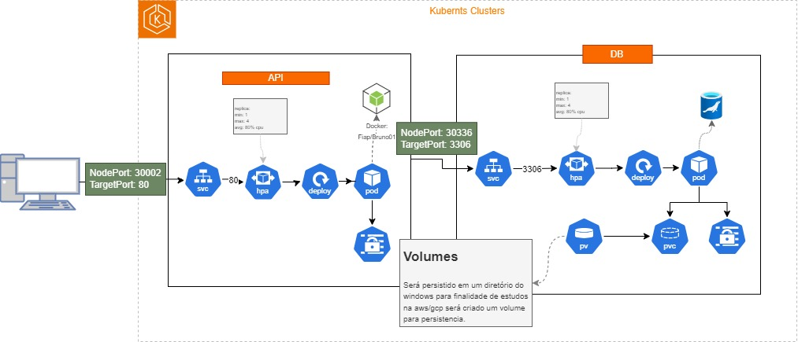

<h1>Tech Challenge</h1>

### TECH CHALLENGE 2



#### - ARQUITETURA TECH CHALLENGE

Aqui iremos mostrar o desenho da arquitetura e como desenvolvemos a solução.

https://www.loom.com/share/d3dee296f478469498f8517de8f3d615?sid=f3df19b9-9f5b-4999-a402-cc458089aa9d

#### - KUBERNETS TECH CHALLENGE

Nessa parte estaremos mostrando o projeto em execução tanto no POSTMAN quando no SGBD e o autoescaling da aplicação e a permanencia dos dados mesmo quando a pod foi excluida e reiniciada novamente.

https://www.loom.com/share/88256ad46d1842c8905884578b9627bd?sid=d1436399-221c-481e-83a1-cb232861e02b

##
### TECH CHALLENGE 3
#### - BANCO DE DADOS RDS MYSQL TECH CHALLENGE

Neste vídeo, estou criando um banco de dados usando o Terraform. Explico o processo passo a passo, desde o planejamento até a configuração das instâncias e subredes. Também mostro as configurações do banco de dados e falo sobre a segurança da VPC. Assista para entender como criar um banco de dados de forma automatizada e segura.

https://www.loom.com/share/899b10cecb8b4618ab141e491e81a8b4?sid=fb46921a-f021-4f11-80a3-ede33b20d431

Codigo: https://github.com/bruno-blauzius/tech-infra-db

#### INFRAESTRUTURA TERRAFORM APPLY INFRA EKS

Neste Entregavel teremos toda a infraestrutura criada com terraform e seus códigos, Explico o processo passo a passo de como foi feito o desenvolvimento e a entrega do projeto, no primeiro video coloco toda a estrutura na aws e no segundo apresento um pouco do código.

Video 1:
https://www.loom.com/share/7f900ff13b2e40a08772ff4b26cf5331?sid=4a97fa7f-365e-4629-8c2b-436e8ab0d823

Video 2: 
https://www.loom.com/share/721f6c6f83b740259bc1be26ca78445c?sid=5ef186c8-1b5b-469e-ad5c-2ddcc9d14dca

Código: https://github.com/bruno-blauzius/tech-infra

## Architecture

- `Architecture` : Hexagonal

  A aquitetura do segue o modelo de diretórios listado a baixo utilizado o NODE js como linguagem de programação.

```bash
    |__ app/
        |__ application/
            |__ api/
                |_ middler
                |_ routes
            |__ core/
            |__ exception/
        |__ cases
        |__ controllers/
        |__ entity/
            |__ enum
        |__ external
        |__ gateways
        |__ interfaces
        |__ types
    |__ terraform
    |__ testes
```

## ENV Variables

```bash
    MARIADB_HOST=localhost
    MARIADB_USER=root
    MARIADB_PASS=12345678
    MARIADB_DATABASE=projeto-pedidos
    MARIADB_PORT=3321

    MP_URL=https://api.mercadopago.com/v1/
    MP_CLIENT_ID=TEST-427f8e8c-d6ca-4000-ab9b-95b3a2e554f7
    MP_CLIENT_SECRET=TEST-8926445123950097-011307-ee5dc50bf53c38a033fe5da4c9acc9c1__LD_LB__-209191463
    MP_NOTIFICATION_URL=https://google.com.br/
```

## Data Base

Banco de dados do projeto é feito com MariaDB, dentro do arquivo de conexão com o banco de dados exite um processo no qual já é criado toda a base de dados assim que for executado o build do projeto.
Cada nova tabela desenvolvida DEVE ser adicionado o create no arquivo para que seja atualizado em todas as imagens.

```bash
  path: src/config/mariaDBConnect.js
  example:
  await db.query(`
        CREATE TABLE IF NOT EXISTS  cliente (
            id INT PRIMARY KEY AUTO_INCREMENT,
            name VARCHAR(200) not null,
            email VARCHAR(245) not null unique,
            cpf_cnpj VARCHAR(20) not null unique,
            birthday date not null,
            created datetime null,
            modified datetime null
        )  ENGINE=INNODB;

        ...
  `);
```
## MODELAGEM DE DADOS


## DATA BASE EXECUTABLE

Deve ser executado esse script no banco de dados, antes de iniciar a criação do pedido na API

```bash
    -- insert data values categoria
    TRUNCATE TABLE categoria;
    INSERT INTO categoria (id, name, created, modified)
            VALUES
            (1, 'Lanche',NOW(), NOW()),
            (2, 'Acompanhamento',NOW(), NOW()),
            (3, 'Bebidas',NOW(), NOW());


    -- insert de produtos
    TRUNCATE TABLE produto;
    insert into `projeto-pedidos`.produto (id, category_id, title, description, value, created, modified)
    values
    (1, 1, 'X-Salada', 'X-salada tradicional', 15.00, now(), now()),
    (2, 1, 'X-Salada com Bacon', 'X-salada tradicional com Bacon', 20.00, now(), now()),
    (3, 1, 'Prensado com duaa vinas', 'Prensado tradicional com duas vinas', 12.00, now(), now()),
    (4, 3, 'Fanta laranja 250ml', 'Fanata laranja lata 250ml', 5.00, now(), now()),
    (5, 3, 'Coca-Cola 250ml', 'cocacola lata 250ml', 5.00, now(), now()),
    (6, 3, 'Guaraná 250ml', 'Guaraná antartica lata 250ml', 5.00, now(), now()),
    (7, 3, 'Cerveja Bhrama 250ml', 'cerveja bramah lata 250ml', 6.00, now(), now()),
    (8, 4, 'Porção de Salada', '300gm de salada', 8.00, now(), now());


    -- criando cliente
    insert into `projeto-pedidos`.cliente(id, name, email, cpf_cnpj, created, modified)
    values (1, 'Heitor Bernardo Victor Nogueira', 'heitoBVN@gmail.com', '31759487740', now(), now());

    -- inserindo pedido
    insert into `projeto-pedidos`.pedidos(id, customer_id, status, total_value, created, modified)
    values (1, 1, 1, '42.00', now(), now());

    -- insert itens do pedido
    insert into `projeto-pedidos`.pedido_produtos(id, order_id, product_id, created, modified)
    values
    (1, 1, 3, now(), now()),
    (2, 1, 2, now(), now()),
    (3, 1, 5, now(), now()),
    (4, 1, 5, now(), now())
    ;

    -- insert checkout test - pagamento por pix
    INSERT INTO checkout
	(uuid, status, payment_method_id, pedido_id, card_number, card_cvv, card_expiration_date, payer_name, payer_email, payer_document, total_value, created, modified)
	 VALUES
	(UUID(), 0, 1, 1, '5482874095004465', 181, '05/2024', 'Heitor Bernardo Victor Nogueira', 'heitoBVN@gmail.com', '31759487740', 42.00, NOW(),  NOW());

```

## Install Application

1. Docker DEVE estar instalado na sua maquina.

2. Baixar o Projeto na sua maquina

```bash
git clone https://github.com/sap1enza/web_cafeteria.git
```

3. Build Project
   `Para Criar o projeto digite o codigo abaixo no console`

```bash
docker-compose up -d --build
```

## Running tests

Aplicação realiza testes unitários com ...

```bash
    npm run test
```

## Autenticação

Foi utilizado o JWT para autenticação de endpoints. O script a baixo retorna o token para autenticação, qual o typo de requisição e o tempo de expiração

```bash
curl -X 'POST' \
  'http://localhost:3000/api/v1/user/auth' \
  -H 'accept: application/json' \
  -d ''
```

# KUBERNETS

Será utilizado Docker Kubernets, para isso deve ser liberado a opção de kubernets no docker desktop, também para utilizar a persistencia de dados DEVE estar desmarcada a opção WSL 2 na sua docker, se certifique que o HIPER-V do windowns esteja habilitado.

### Arquitetura

Para garantir a alta disponibilidade do sistema foi utilizado o kubernets, usando em sua aplicação escalabilidade horizontal quando atingir a capacidade de 80% do cpu da POD, e sua porta para o ambiente externo está na 30002 referenciada por uma porta interna 80.

O banco de dados a principio não é alto escalavel porém foi configurado para uma unica replica sendo assim podemos mudar com facilidade adicionando a escalabilidade horizontal, também foi criado um volume para persistência de dados assim garantimos a integridade dos dados quando uma pod morrer ou for excluída.
A porta para para o ambiente externo está na 30336 e referenciada para o ambiente interno na porta padrão no mariadb 3306.

### Para atualizar a aplicação

DEVE ser criada uma nova imagem no DockerHub e atualizar o arquivo de deployment no diretório kubernets/api/ arquivo dep-api.yaml
Variáveis de ambiente são adicionadas no arquivo dep-api.yaml.

```bash
    #Build image
    docker build -t <IMAGE_NAME> .
    #Create tag image
    docker tag <IMAGE_NAME>:<TAG> <DOCKER_USER>/<IMAGE_NAME>:<TAG>
    #Push Image
    docker push <DOCKER_USER>/<IMAGE_NAME>:<TAG>

```

1. Libere as metricas na sua Docker Kubernets para o HPA.

```bash
    kubectl apply -f kubernets/components.yaml
```

2. Subindo o banco de dados com persistencia em volumes

```bash
    kubectl apply -f kubernets/db/
```

3. Subindo a api

```bash
    kubectl apply -f kubernets/api/
```

OBS. executando o diretorio inteiro o kube irá em todos os subdiretórios executando.
